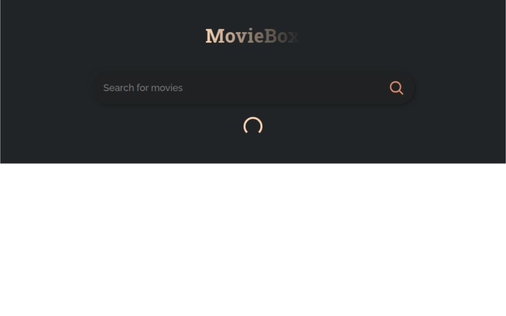

<div align="center">
  <h2 align="center">MovieBox - Car Rental Website</h2>

 MovieBox is a React Vite application that allows users to search for movies using the OMDB API. <br/> Built using React.js and OMDB API. <br/>

  <a href="https://movies-box-livid.vercel.app/"><strong>➥ Live Demo</strong></a>

</div>

<br />

### Demo Screeshots



### Prerequisites


### Installing Ridex

To install **MovieBox**, run this command on your git bash:

Linux and macOS:

```bash
sudo git clone https://github.com/Abimbolacodes/Movies_Box/
```

Windows:

```bash
git clone https://github.com/Abimbolacodes/Movies_Box/
```

## 💬 Contact

If you have an offer, opportunity, or introduction that might make my life more interesting, email me at olatunjiabimbola17@gmail.com.

For the reasons stated above, I'll only respond to proposals that are matched for my schedule and interests.

### License

This project is **free to use** and does not contains any license.
